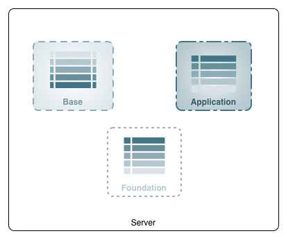
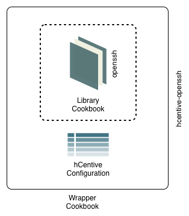

This document describes the pattern for writing Chef cookbooks for hCentive's applications.

As with most software, it is essential to develop Chef cookbooks keeping reusability in mind. Some of the best practices to follow when writing cookbooks are described below.

## <a name="design"></a>Design

This pattern is used to construct [AMIs for the three types of servers](https://sites.google.com/a/hcentive.com/infra/home/disaster-recovery/disaster-recovery-design#amis-for-all) defined in the disaster recovery design document. Cookbooks are defined at three levels - foundation, base and application. The design makes use of the application, [library](#library-cookbook) and [wrapper](#wrapper-cookbook) cookbook patterns usually referred to as [The Berkshelf Way](http://devopsanywhere.blogspot.com/2012/11/how-to-write-reusable-chef-cookbooks.html).

The foundation cookbook is run first on a newly provisioned server, followed by base and application cookbooks. A server will be completely setup to run an application only after the foundation, base and application cookbooks are run on it.



### <a name="foundation-cookbook"></a>The Foundation Cookbook
A foundation cookbook has recipes to setup a [foundation server](https://sites.google.com/a/hcentive.com/infra/home/disaster-recovery/disaster-recovery-design#foundation-ami). These recipes install the set of packages that are required on all servers at hCentive. The cookbook also configures these packages with options specific to hCentive's requirements. For example, `ntpd` is installed and configured to synchronize the system clock with hCentive's [stratum](http://www.ntp.org/ntpfaq/NTP-s-algo.htm#Q-ALGO-BASIC-STRATUM) 2 NTP servers instead of the OS defaults. Similarly, `nagios` client is installed and configured to allow NRPE checks from hCentive's nagios servers only. A list of all recipes, and their configurations, is mentioned in the README for the foundation cookbook.

The `hcentive-foundation` cookbook has a `default` recipe, and recipes specific to `ubuntu` and `redhat` distribution. The `redhat` recipe, for example, will include the `yum` recipe for package management, whereas the `ubuntu` recipe will include `apt` to do the same job.

### <a name="base-cookbook"></a>The Base Cookbook
The base cookbooks are written to setup [base servers](https://sites.google.com/a/hcentive.com/infra/home/disaster-recovery/disaster-recovery-design#base-ami). They include the [foundation cookbook](#foundation-cookbook) and recipes to install components to setup various base servers for installation of hCentive applications. The cookbooks also include custom configuration to setup these components for hCentive's requirements. An example is a cookbook that sets up a web server to run tomcat applications. This server will have Oracle JDK, Tomcat, Tomcat database connector and Apache web server installed and configured on it. Recipes for components installed with a base cookbook are listed in the README for the cookbook.

The nomenclature for base cookbooks is `{server-type}-base`. For example, `tomcat7-base`, or `jboss-base`.

### <a name="application-cookbook"></a>The Application Cookbook
The application cookbook is a level above the [base cookbook](#base-cookbook). It configures an hCentive product on a server after a Jenkins deployment. It, essentially, implements the configuration guide published by the development team to configure a product. For example, the application cookbook for PHIX web application will depend on the `tomcat7-base` cookbook, and have its own recipes to setup context files for various portals. It will also have recipes to update apache configuration to serve static content.

Application cookbooks are named after the application they deploy. Most applications have components that can be deployed separately or together with other components. Each component should have a cookbook of it's own. For example, `phix-ui` and `phix-webservice`. They should include the name of the base server whenever possible - `{application}-{baseserver}` like `phix-batchserver`.

## References
As mentioned in the [introduction](#design) to this page, this design makes use of the library, wrapper and application cookbook patterns. The following section describes the library and wrapper cookbooks.

### <a name="library-cookbook"></a>The Library Cookbook
A library cookbook is an abstract cookbook that defines are set of actions that provide common functionality.
The library cookbook works with a number of concrete providers to implement library functions.
An example is a `db` library cookbook that has [LWRPs](https://docs.chef.io/lwrp.html) for installing, starting, stopping and backing up databases. The provider (or concrete) cookbooks that use the `db` library cookbook are `db_postgresql` and `db_oracle` cookbooks. These concrete cookbooks implement actual installation, start/stop and backup resources.

A reference implementation can be found in the `db` cookbooks by [RightScale](https://github.com/rightscale/rightscale_cookbooks/tree/master/cookbooks).

### <a name="wrapper-cookbook"></a>The Wrapper Cookbook
As a practice, original cookbooks, like a [community](https://supermarket.chef.io) or library cookbook, should not be modified. A wrapper cookbook should be created that modifies the behaviour of the original cookbook by changing default configuration. It will "wrap" the original cookbook with any configuration changes that are made. For example, a wrapper cookbook that sets up `openssh` with hardening procedures applied to it. The name of a wrapper cookbook is derived from the cookbook it is wrapping - like `hcentive-openssh`.



## <a name="extending-cookbooks"></a>Extending Cookbooks
Just like modifying a community cookbook is [not a recommended practice](http://dougireton.com/blog/2013/02/16/chef-cookbook-anti-patterns/), modifying a shared hCentive cookbooks for a specific project is discouraged. If there is a requirement to modify a shared hCentive cookbook for a project, it is recommended to extend (or wrap) the cookbook.

For instance, there may be a requirement to enable a specific apache module for a project. To do this, create a project specific wrapper cookbook `<project>-apache` that depends on the `hcentive-apache` cookbook. Then set the `['hcentive']['extra_modules']` attribute with the value of the module you need enabled for the project.

Create a wrapper cookbook
```bash
$ berks cookbook phix-apache
```

Add a dependency for `hcentive-apache` cookbook in the cookbook's `Berksfile`
```ruby
cookbook "hcentive-apache", git: "https://git.demo.hcentive.com/hcentive-apache"
```

If required, you can add a version constraint
```ruby
cookbook "hcentive-apache", "=1.0.0", git: "https://git.demo.hcentive.com/hcentive-apache"
```
Documentation for more options is available in Berkshelf's [documentation](http://berkshelf.com).

Add a dependency in the `metadata.rb` file
```ruby
depends "hcentive-apache"
```

If required, you can add a version constraint
```ruby
depends "hcentive-apache", "=1.0.0"
```


In `phix-apache` cookbook, create a default attributes file, `attributes/default.rb` and override the `[hcentive][extra_modules]` attribute. For example, if you want to enable content caching, add `mod_headers` to the list
```ruby
override['hcentive']['extra_modules'] = ['headers']
```

## <a name="references"></a>References
* [Chef Patterns](http://bytearrays.com/chef-cookbook-patterns/)
* [Doing Chef Cookbooks Right](https://www.chef.io/blog/2013/12/03/doing-wrapper-cookbooks-right/)
* [Role Cookbooks and Wrapper Cookbooks](http://realityforge.org/code/2012/11/19/role-cookbooks-and-wrapper-cookbooks.html)
