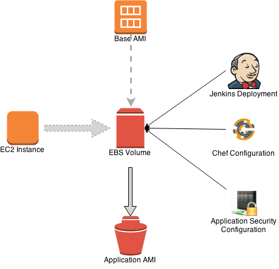
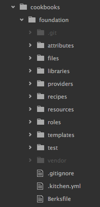

This document describes the design for [EC2 AMI](http://docs.aws.amazon.com/AWSEC2/latest/UserGuide/AMIs.html) provisioning.

## <a name="amis-for-all"></a>AMIs For All Servers
[Amazon Machine Images (AMIs)](http://docs.aws.amazon.com/AWSEC2/latest/UserGuide/AMIs.html) are created for servers with all required components and applications installed.

Considering the variety of server types, it is necessary to create foundation and base AMIs for operating systems and server types, respectively. From the base AMI, application specific AMIs are created.


### <a name="foundation-ami"></a>Foundation AMI
The Foundation AMI is an image created with an AMI of a Linux distribution supported by hCentive's applications with the default set of tools installed on it. For example, a [Ubuntu 12.04 LTS 'precise' cloud image](http://cloud-images.ubuntu.com/precise/current/) with hardening procedures applied and NRPE installed. This AMI is used to create Base AMIs for various server types. There are typically only very few foundation AMIs.

The process for creating a foundation AMI involves
* launching an instance with a standard Linux distribution
* attaching an empty EBS volume
* installing the minimal OS and required tools
* implementing server hardening procedures
* taking a snapshot and registering an AMI based on the snapshot.


### <a name="base-ami"></a>Base AMI
The Base AMI is created from the foundation AMI by installing required components on it via a package manager (APT or YUM) or installation scripts. For example, a Java/Tomcat web application base AMI will have stable, supported versions of Sun JDK and Tomcat installed on it; and also Tomcat hardening procedures applied to it.

To construct a base AMI
* mount an EBS volume created from a foundation AMI snapshot
* install required packages on it
* apply specific application security procedures on it
* dismount the volume, snapshot it, and register as a base AMI
* test the base AMI and release it


The base AMI is updated and tested regularly. The updated AMIs are released as candidates to developers and testers to test critical updates or improvements.

### <a name="application-ami"></a>Application AMI
The Application AMI is created from the base AMI by deploying application code and configuration to it via Jenkins. For example, deploying PHIX code with configuration for a QA environment to an EBS volume created from a web application base AMI snapshot. A snapshot is created of this volume and registered as an AMI.

This process of creating various AMIs is sometimes called "baking" AMIs. The instance(s) utilized to bake AMIs is called a "bakery" instance.

To bake an application AMI
* launch bakery instance
* create EBS volume from base AMI snapshot
* attach volume and deploy code and configuration
* snapshot volume and register AMI



As Jenkins is used to deploy applications and configuration to instances, it can also execute a script to create the application AMI after the deployment is complete.

Creating an AMI after each deployment will result in a lot of AMIs being created. Cleanup of retired AMIs is automated to simplify AMI management.

## <a name="chef-workflow"></a>Chef Workflow
[Chef](https://www.chef.io) is used to deploy components and application code to the instances. The chef workflow is designed to compliment the AMI hierarchy described [above](#amis-for-all) and the project hierarchy within hCentive. The [cookbook design pattern](https://sites.google.com/a/hcentive.com/infra/home/knowledge-base/chef-cookbook-design) describes in detail how to develop cookbooks to implement the AMI hierarchy.

### <a name="chef-security"></a>Security
Chef server is deployed in the management services VPC. It can only be accessed within the company network. It is setup to authenticate against hCentive's Active Directory to allow access to only authorized hCentive employees.

### <a name="chef-acl"></a>Organization, Groups and Users
Chef server uses role-based access control to restrict access to various objects (nodes, environments, cookbooks, etc.). This ensures that authorized users and chef clients have access to objects on the chef server.

Role based access is defined by organizations, groups and users. A default organization (hCentive) is setup during installation. An organization contains default and user-defined groups, at least one node and one user. Groups define access to objects on the chef server, and also permissions for members of the groups. Chef creates three default groups - `admins`, `clients` and `users`. Users are non-administrator developers who upload data to the chef server from their workstations. A user can be member of multiple groups. A chef client uses the chef server API to interact with the server. It is an agent that runs on every node registered with the chef server. Every node is automatically added to the `clients` group.

### <a name="chef-cookbooks"></a>Cookbooks
The following guidelines are to be followed when creating cookbooks
* Explicit cookbook for every project - each project is different even if it implements the same product.
* Explicit namespace for every project - this ensures a single top-level attribute tree for each project, and avoids collisions with shared cookbooks.
* Prefer Ruby [hashes](http://www.ruby-doc.org/core-1.9.3/Hash.html) to [arrays](http://www.ruby-doc.org/core-1.9.3/Array.html) for defining attributes - hashes are easier to work with than arrays. They can also be extended by adding or removing key/value pairs when needed.
* Provide defaults for attributes where necessary - implicit assumptions about custom attribute values can be a source of confusion. Wherever applicable, a default value for an attribute should be supplied and not assumed.
* Roles should be named along multiple dimensions - for example, product, component, etc. (`cp-tomcat`, `wig-jboss-cluster`).

## <a name="ami-creation"></a>AMI Creation and Management
Initial AMI design inspiration to create AMIs from cloud images came from an [article (and source code) by Eric Hammond](http://alestic.com/alestic-git/) while setting up [Gitolite authorization](https://hcentive.jira.com/wiki/display/TECHOPS/Git+access+control+with+Gitolite) for hCentive's git instance. AMI hierarchy is derived from Netflix's open source application AMI creation tool [Aminator](https://github.com/Netflix/aminator).

For hCentive's design, we use [Packer](https://packer.io) and [Chef](https://chef.io) to create the foundation and base AMIs. This method is recommended over using `bash` [scripts](#foundation-bash).

We can also create the AMIs using bash scripts and chef, and then use Aminator to bake application AMIs.

### <a name="foundation-packer"></a> Creating the Foundation AMI with Packer and Chef

This section describes how to create a [Foundation AMI](https://sites.google.com/a/hcentive.com/infra/home/disaster-recovery/disaster-recovery-design#TOC-Foundation-AMI) using [Packer](https://packer.io), [Chef](https://www.chef.io) and [Berkshelf](http://berkshelf.com).

#### Packer
[Packer](https://packer.io) is a tool for creating identical machine images for multiple platforms from a single source configuration. That means the same packer file can be used to create images for Virtualbox (development) and AWS (QA, production, DR) with the exact same packages and applications installed on them.

#### Chef
[Chef](https://www.chef.io) is a configuration management and automation platform. It helps us describe infrastructure as code. This enables automating, testing and reproducing infrastructure with ease.

Chef's core principles are idempotence, thick clients-thin servers and order matters. If a chef recipe is run multiple times on the same system, the results will be identical every time. Any action that the chef client performs is done the same way every time. The chef client will not perform actions on a resource that has not changed.

#### Berkshelf
[Berkshelf](http://berkshelf.com) is a dependency manager for Chef cookbooks much like Maven for Java applications. It greatly simplifies the process of downloading and install community cookbooks.

It is not required to use Berkshelf to manage Chef dependencies. But it is highly recommended.

### <a name="ami-creation-packer"></a>Creating the AMI

#### Pre-requisites
The following components should be installed should be installed on the development workstation used to bake AMIs
* Packer - installation instructions [here](https://www.packer.io/intro/getting-started/setup.html).
* Chef development kit - installation instructions [here](https://downloads.chef.io/chef-dk/)
* Berkshelf - installing  Chef Development Kit ([Chef-DK](http://chef.io/downloads/chef-dk)) will install Berkshelf. Getting started instructions are [here](http://berkshelf.com).

#### Design
Packer can build images for multiple platforms including AWS EC2 and Virtualbox. EC2 images are used to launch instances for testing and production. Virtualbox images are used with Vagrant for development. The same Packer template can be used to build identical images for both EC2 and Virtualbox.


##### Packer Template
A Packer [template](https://www.packer.io/docs/templates/introduction.html) to create an Ubuntu foundation AMI, that is provisioned with `chef-solo`, looks like this
``` json
{
  "variables": {
    "brand": "foundation",
    "distribution": "ubuntu",
    "release": "12.04",
    "architecture": "x86_64"
  },
  "builders": [{
    "type": "amazon-ebs",
    "region": "us-east-1",
    "source_ami": "ami-34cc7a5c",
    "instance_type": "t2.micro",
    "vpc_id": "vpc-c479dea1",
    "subnet_id": "subnet-5d777775",
    "ssh_username": "ubuntu",
    "ami_name": "{{user `brand`}}-{{user `distribution`}}-{{user `release`}}-{{user `architecture`}}-ebs-{{timestamp}}"
    }],
    "provisioners": [
    {
      "type": "chef-solo",
      "cookbook_paths": ["../cookbooks", "../cookbooks/foundation/vendor"],
      "roles_path": "../cookbooks/foundation/roles",
      "run_list": ["role[ubuntu-foundation]"]
    }
  ]
}  
```

The `variables` section defines [user variables](https://www.packer.io/docs/templates/user-variables.html) used in other sections of the template. For example, in constructing the `ami_name` value for the `amazon-ebs` builder. The variables section above defines the following variables -
* `brand` - the type of AMI. The values can be - `foundation`, `base` and `application`.
* `distribution` - name of the operating system distribution. The values can be - `ubuntu` and `rhel`.
* `release` - the release version of the distribution. hCentive certified values for `ubuntu` are - `12.04` and `14.04`; and for `rhel` is `6.4`.
* `architecture` - the architecture for the distribution. The value can be `x86_64`.

The `builders` section contains a list of [builders](https://www.packer.io/docs/templates/builders.html) that Packer uses to create machine images. A builder requires at least the `type` key. It's value is the name of the builder that is used to create the machine image. The builders section above defines the `amazon-ebs` builder with the following keys -
* `type` - the builder type. The value can be `amazon-ebs`. hCentive uses only EBS backed AMIs. Instance store AMIs are not supported. Differences between the two can be found  [here](http://docs.aws.amazon.com/AWSEC2/latest/UserGuide/RootDeviceStorage.html)
* `region` - the [AWS region](http://docs.aws.amazon.com/AWSEC2/latest/UserGuide/using-regions-availability-zones.html) in which to create and register the AMI. `us-east-1` is required for dev, QA and disaster recovery AMIs.
* `source_ami` - the AMI to use to bake the foundation AMI from. The values depend on the `distribution`, `release` and `region`. Value for `ubuntu` `12.04` in `us-east-1` is `ami-34cc7a5c`; for `ubuntu` `14.04` in `us-east-1` is `ami-76e27e1e`; and the value for `rhel` `6.4` in `us-east-1` is `ami-1643ff7e`.
* `vpc_id` and `subnet_id` - these keys define where the instance Packer launches the EC2 instance to bake the AMI. Values for these are set to `vpc-c479dea1` (IT VPC) and `subnet-5d777775` (critical services subnet).
* `ssh_username` - the SSH username for the instance. Values are `ubuntu` for, well, Ubuntu and `ec2-user` for RHEL.
* `ami_name` - the value is constructed by concatenating the `brand`, `distribution`, `release`, `architecture` user variables, the [`timestamp`](https://www.packer.io/docs/templates/configuration-templates.html#timestamp) function.

The `provisioners` section defines the [provisioner](https://www.packer.io/docs/templates/provisioners.html) used to install and configure software on the AMI. The following keys are defined for the [`chef-solo`](https://www.packer.io/docs/provisioners/chef-solo.html) provisioner
* `type` - the type of provisioner. The value is `chef-solo`.
* `cookbooks_paths` - the list of directories where cookbooks are stored. In the example above the path is relative to where the `packer build` command is run from. Absolute paths to directories on the local system can also be specified.
* `roles_path` - the path to directory where "[roles](http://docs.chef.io/roles.html)" are stored.
* `run_list` - the [run list](http://docs.chef.io/nodes.html#about-run-lists) for Chef. This is an array of strings. For Ubuntu foundation AMI, this is set to `role[ubuntu-foundation]`.

> We use the `chef-solo` provisioner instead of the `chef-client` provisioner because the foundation AMI will not be used to create a node directly, and thus does not need to be provisioned as a node.

To validate the packer template file, run the following command
```
› packer validate packer.json
Template validated successfully.
```

##### Packer Build
To create an AMI, run the `packer build` command. The command expects the packer template file as an argument.
```
> packer build packer.json
```

Packer will launch an instance with the `source_ami` in the VPC and subnet specified by `vpc_id` and `subnet_id`, respectively. It then installs `chef` on the instance and runs the recipes (or roles) specified in the `run_list`.

When the `packer build` command finishes successfully, Packer outputs the AMI ID for the AMI that was created.
```
==> Builds finished. The artifacts of successful builds are:
--> amazon-ebs: AMIs were created:

us-east-1: ami-7afa9112
```

### <a name="foundation-bash"></a>Creating the Foundation AMI with bash and EC2 API
To construct the foundation AMI, we create a [CloudFormation](http://aws.amazon.com/cloudformation/) template to launch an EC2 instance that will be used to create the AMI.
The cloudformation template defines the following
* IAM role and policy
* instance profile with the IAM role assigned to it
* security group for the instance allowing SSH
* autoscaling group and launch configuration to launch the instance in

The [`bash` script](https://phabricator.demo.hcentive.com/diffusion/DR/browse/master/src/foundation-ami/ubuntu/build-ami) to create the AMI does the following
* downloads a base Ubuntu server image created by [Canonical](http://cloud-images.ubuntu.com) (RHEL will be next)
* extracts the image to a target filesystem and prepares a chroot jail environment
* installs necessary packages and tools on target filesystem
* creates an EBS volume; copies temporary target filesystem to it
* creates snapshot of the EBS volume, and then registers the snapshot as an AMI

### <a name="chef-cookbook"></a>Chef Cookbook
The cookbook for the foundation AMI installs the following components regardless of the operating system (Ubuntu, RHEL), and configures them
* [openssh](https://supermarket.chef.io/cookbooks/openssh)
* [nrpe](https://supermarket.chef.io/cookbooks/nrpe)
* [chef-client](https://supermarket.chef.io/cookbooks/chef-client)

All of these are chef [community cookbooks](https://supermarket.chef.io) that are part of the recipe for the foundation AMI. The default attributes of some of these cookbooks are overridden to meet server hardening requirements. For example, password authentication for `openssh` is overriden to `no` from the default `yes`; and the chef validation key is deleted from the chef client after the `chef-client` cookbook is run.

#### Berkshelf
Cookbook dependencies are managed with [Berkshelf](http://berkshelf.com). It is a simple way to manage cookbooks. Bershelf is distributed as part of [Chef-DK](http://chef.io/downloads/chef-dk).

To create the foundation AMI using Berkshelf create the [`foundation`](https://phabricator.demo.hcentive.com/diffusion/DR/browse/master/src/foundation-ami/cookbooks/foundation/) cookbook, run the `berks cookbook` command in the `cookbooks` directory

```bash
› berks cookbook foundation
    create  foundation/files/default
    create  foundation/templates/default
    create  foundation/attributes
    create  foundation/libraries
    create  foundation/providers
    create  foundation/recipes
    create  foundation/resources
    create  foundation/recipes/default.rb
    create  foundation/metadata.rb
    create  foundation/LICENSE
    create  foundation/README.md
    create  foundation/CHANGELOG.md
    create  foundation/Berksfile
    create  foundation/Thorfile
    create  foundation/chefignore
    create  foundation/.gitignore
    create  foundation/Gemfile
    create  .kitchen.yml
    append  Thorfile
    create  test/integration/default
    append  .gitignore
    append  .gitignore
    append  Gemfile
    append  Gemfile
  You must run `bundle install` to fetch any new gems.
    create  foundation/Vagrantfile

```

The command will create the boilerplate folder structure and code for a new cookbook. It will also create the `Berksfile`.



Cookbook dependencies are specified in the [`Berksfile`](https://phabricator.demo.hcentive.com/diffusion/DR/browse/master/src/foundation-ami/cookbooks/foundation/Berksfile). It defines the source of the community or vendor cookbooks, and the cookbooks to download

```ruby
source "https://supermarket.getchef.com"

metadata

cookbook "apt"
cookbook "yum"
cookbook "openssh"
cookbook "chef-client"
cookbook "nrpe"
```

The vendor cookbooks are downloaded to the `~/.berkshelf` directory as a default. But we want to ship the cookbooks to be run on our instance. So, we change the default vendor directory to be relative to the foundation cookbook. To do this, we run the `berks vendor` command in the `foundation` folder

```bash
› berks vendor vendor
Resolving cookbook dependencies...
Fetching 'foundation' from source at .
Fetching cookbook index from https://supermarket.getchef.com...
Using apt (2.6.1)
Using chef-client (4.0.0)
Using build-essential (2.1.3)
Using chef_handler (1.1.6)
Using cron (1.6.1)
Installing iptables (0.14.1)
Using foundation (0.1.0) from source at .
Using logrotate (1.7.0)
Using nrpe (1.4.8)
Using openssh (1.3.4)
Using windows (1.36.1)
Using yum (3.5.2)
Installing yum-epel (0.6.0)
Vendoring apt (2.6.1) to vendor/apt
Vendoring build-essential (2.1.3) to vendor/build-essential
Vendoring chef-client (4.0.0) to vendor/chef-client
Vendoring chef_handler (1.1.6) to vendor/chef_handler
Vendoring cron (1.6.1) to vendor/cron
Vendoring foundation (0.1.0) to vendor/foundation
Vendoring iptables (0.14.1) to vendor/iptables
Vendoring logrotate (1.7.0) to vendor/logrotate
Vendoring nrpe (1.4.8) to vendor/nrpe
Vendoring openssh (1.3.4) to vendor/openssh
Vendoring windows (1.36.1) to vendor/windows
Vendoring yum (3.5.2) to vendor/yum
Vendoring yum-epel (0.6.0) to vendor/yum-epel
```

This creates a `vendor` directory and download vendor cookbooks.

#### Foundation Roles
The foundation cookbook defines three [roles](http://docs.chef.io/roles.html)
* `foundation` - an abstract role that defines basic attributes and recipes for all foundation AMIs
* `ubuntu-foundation` - includes the `foundation` role and recipes specific to Ubuntu
* `rhel-foundation` - includes the `foundation` roles and recipes specific to RHEL

The [`foundation`](https://phabricator.demo.hcentive.com/diffusion/DR/browse/master/src/foundation-ami/cookbooks/foundation/roles/foundation.json) role defines a `run_list` that runs the `openssh`, `nrpe` and `chef-client` recipes.

```json
"run_list": [
  "recipe[openssh]",
  "recipe[nrpe]",
  "recipe[chef-client]",
  "recipe[chef-client::delete_validation]"
]
```

It also overrides default attributes of all three recipes. For example, setting attribute values to secure `openssh`

```json
"override_attributes": {
  "openssh": {
    "server": {
      "allow_agent_forwarding": "no",
      "allow_tcp_forwarding": "no",
      "client_alive_count_max": "0",
      "client_alive_interval": "600",
      "ignore_user_known_hosts": "yes",
      "login_grace_time": "30s",
      "password_authentication": "no",
      "permit_root_login": "no",
      "rsa_authentication": "no"
    }
  }
}
```

As mentioned above, this is an abstract role that is included in more concrete, distribution specific roles. For example, the `ubuntu-foundation` role includes the `foundation` role in it's `run_list` along with the `apt` recipe.

```json
"run_list": [
  "recipe[apt]",
  "role[foundation]"
]
```

When provision an Ubuntu foundation AMI with Packer, we assign the `ubuntu-foundation` role to the instance in the `chef-solo` provisioner in the packer file.

```ruby
"provisioners": [
  {
    "type": "chef-solo",
    "cookbook_paths": ["../cookbooks/foundation/vendor"],
    "roles_path": "../cookbooks/foundation/roles",
    "run_list": ["role[ubuntu-foundation]"]
  }
]
```

#### Cookbooks Installation
Now we run the `berks install` command to install the cookbooks in the `vendor` directory. It will also download dependencies and install them in the `vendor` directory.

```bash
> berks install
Resolving cookbook dependencies...
Fetching 'foundation' from source at .
Using apt (2.6.1)
Using chef-client (4.0.0)
Using build-essential (2.1.3)
Using chef_handler (1.1.6)
Using cron (1.6.1)
Using foundation (0.1.0) from source at .
Using iptables (0.14.0)
Using logrotate (1.7.0)
Using nrpe (1.4.8)
Using openssh (1.3.4)
Using windows (1.36.1)
Using yum (3.5.2)
Using yum-epel (0.5.3)
```

The path of the `vendor` cookbooks is specified as the `cookbooks_path` value in the `chef-solo` provisioner in the packer file.

```ruby
"cookbook_paths": ["../cookbooks/foundation/vendor"]
```
The `chef-solo` provisioner will look for the `ubuntu-foundation` role and execute it's `run_list` on the instance before Packer creates an AMI of the instance.

# <a name="references"></a>References
* [Amazon EC2 Root Device Volume](http://docs.aws.amazon.com/AWSEC2/latest/UserGuide/RootDeviceStorage.html
)
* [alestic-git](https://github.com/alestic/alestic-git)
* [Netflix Aminator](https://github.com/Netflix/aminator)
* [Disaster Recovery code and documentation repository](https://phabricator.demo.hcentive.com/diffusion/DR/)
* [Cookbook design](cookbook-design.md)
